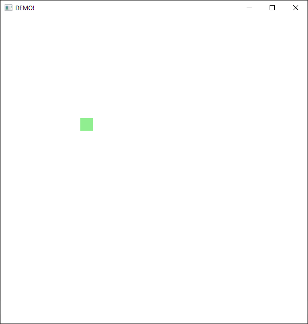

## Java FX 2D Graphisc Example

* Create a JavaFX application in which a  rectangle will move within a canvas using the WASD keyboard key

* Add border for movement that rectangle cannot escape from canvas.
* Implement infinite boundaries which wrap around the game area. When rectangle reaches one edge of the game area, it reappears on the opposite edge.

